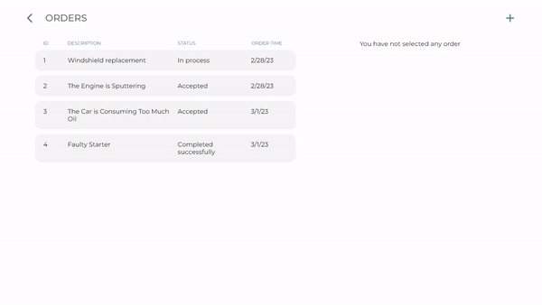
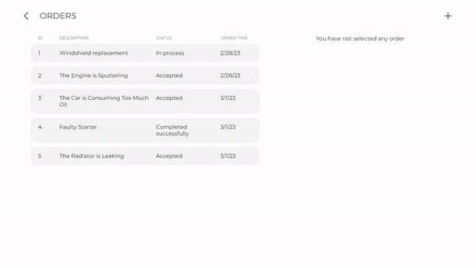

<h1 align="center">
  Car Service API ⚙️🚗⚙️
</h1>

<p align="center">
  <a href="#-description">Description</a> •
  <a href="#-features">Features</a> •
  <a href="#-architecture">Architecture</a> •
  <a href="#-technologies">Technologies</a> •
  <a href="#-how-to-start-the-program">How to start the program</a> •
  <a href="#-uml-models-diagram">UML diagram</a>
</p>

## 📃 Description
Car Service is a web-application created to save car service orders in the database. The program is written in Java with Spring Boot and uses PostgreSQL as a database. The front-end part uses HTML/CSS, TypeScript and the Angular framework. For API testing, you can use Swagger, which is also available in the app.

## 🚀 Features
In this program, you can store such data as information about drivers, their cars and orders. In addition, used goods and performed service work are stored (detailed information about models can be found on the [UML diagram](#-uml-models-diagram)). At the end of the completed order, you can calculate the total price for the work, and if the client refused to use the service, then he will only pay the amount for diagnostics in the amount of UAH 500. Also available is the calculation of wages for craftsmen, which is calculated as 40% of the price of the performed service work.

Here you can see how to create new order using frontend [page](http://localhost:4200/orders)



Also, by selecting the desired order, you can view its details and change them



The frontend part also has a global error interceptor that opens a standard browser dialog with a description of the problem and the error status code

## ⚙ Architecture
|       3-layer architecture       |
|:--------------------------------:|
|  Controller (Presentation layer) |
|                ↓↑                |
|    Service (Application layer)   |
|                ↓↑                |
|  Repository (Data access layer)  |

## 🧑‍💻 Technologies
| Technology    | Version |
|:--------------|:--------|
| Backend       |         |
| JDK           | 17      |
| Maven         | 4.0.0   |
| Spring Boot   | 3.0.1   |
| Swagger       | 2.9.2   |
| PostgreSQL    | 15      |
| Liquibase     | 4.17.2  |
| Lombok        | 1.8.24  |
| Docker        | -       |
| Frontend      |         |
| Angular       | 15.1.2  |
| npm           | 9.3.1   |

## 📎 How to start the program
**To run an application via Docker, you must have the latest version of Docker installed on your local machine!**
### Run Backend
1. Clone the project from GitHub
2. Open terminal in the project folder and run `mvn clean package -DskipTests` (you must also have Maven installed)
3. When the project was built successfully, run the following command: `docker-compose up`
4. After a successful start, the program can be tested using the link `http://localhost:6868/api/swagger-ui.html`

### Run Frontend
5. Install npm by the [link](https://docs.npmjs.com/downloading-and-installing-node-js-and-npm)
6. Open terminal in folder `/frontend` and run `npm start` (if you started the backend part in another way, don't forget to change your port in [proxy.conf.json](https://github.com/pavlogook/car-service/blob/04d5d80d9de8579b0cb521230cdcbc63389869b2/frontend/proxy.conf.json#L3):
```
{
  "/api/*": {
    "target": "http://localhost:6868",    // Change the port here
    "secure": false,
    "logLevel": "debug",
    "changeOrigin": true
  }
}
```
7. When the compilation is completed successfully, open the [link](http://localhost:4200) in your browser
8. Enjoy the program 😉

## ✨ UML models diagram

